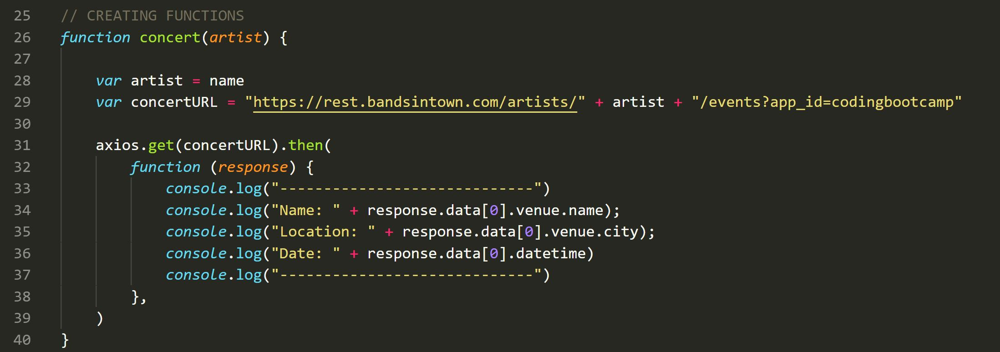
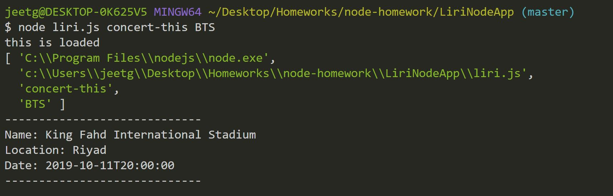
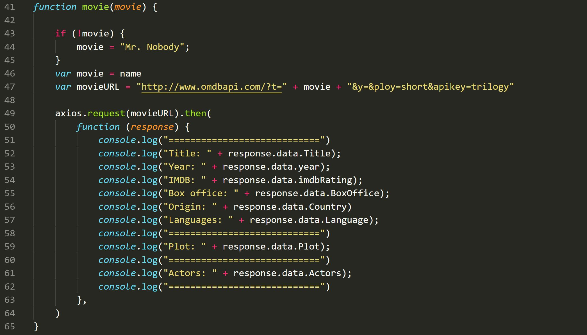
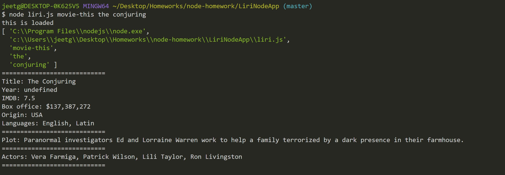
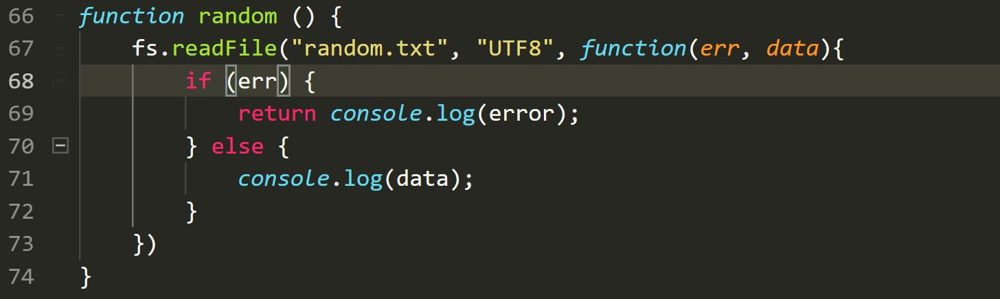
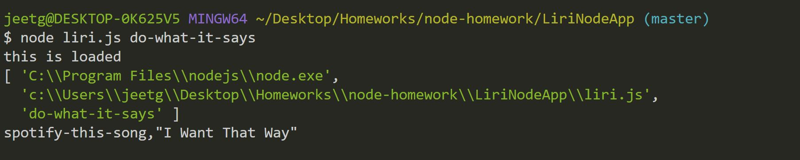

# liriNodeApp

* This app is getting the api's from omdb, spotify, moment and giving back the data in the terminal.
* Also to use this app we had to download few node packages. 
* I could not get the spotify api to work.
* Below are the images from the working app.

## Things to work on: 
### Getting the spotify API to work on terminal and create a function.
